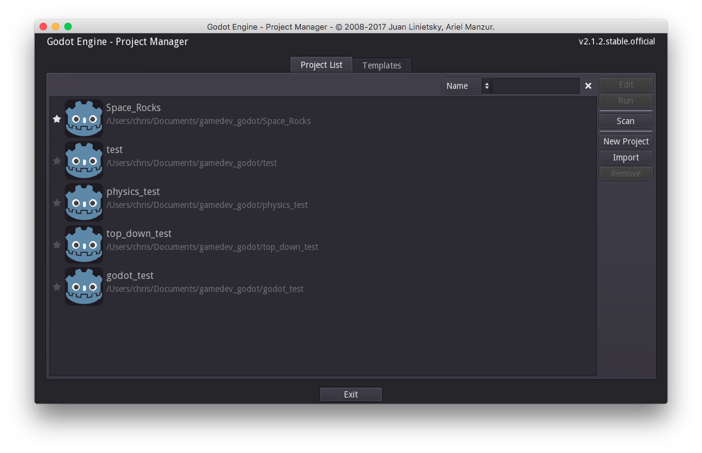
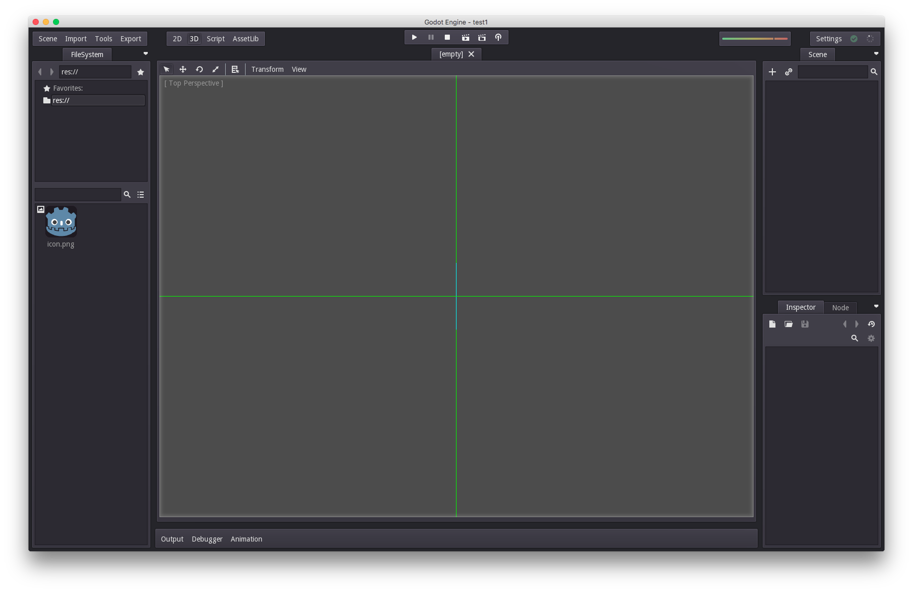
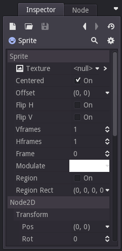
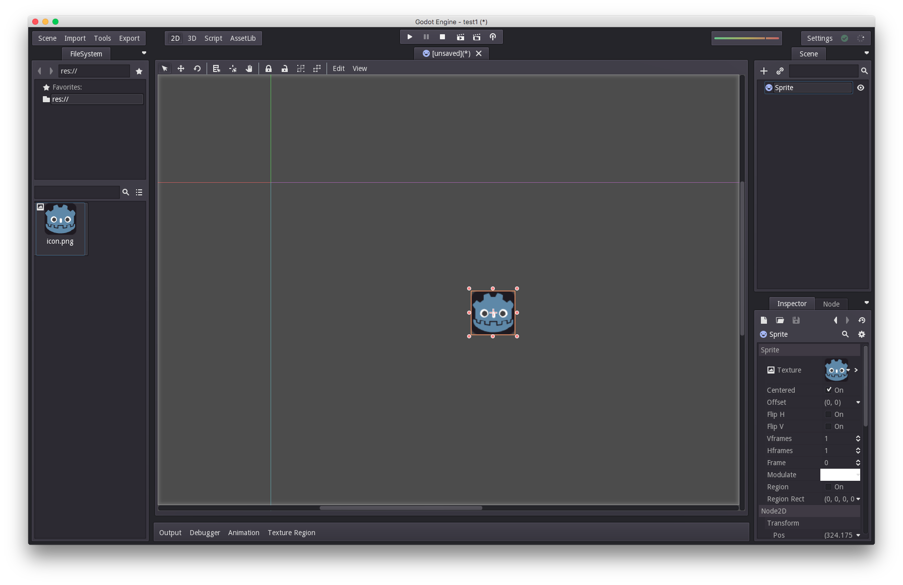
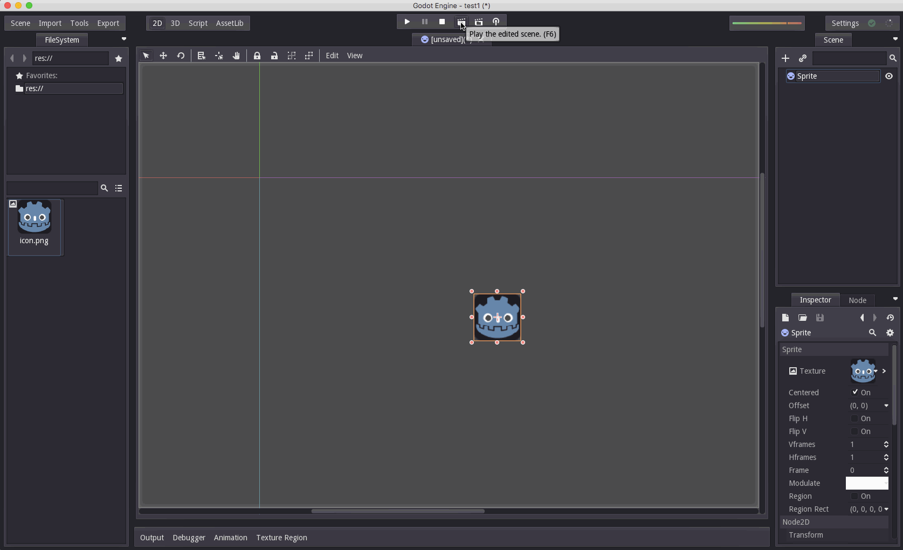

Title: Godot 101 - Частина 1: Вступ до Godot 
Date: 2019-09-11 12:25
Category: 101
Tags: Godot, tutor
Modified: 2019-09-11 12:25

## Про цю серію
Godot 101 - це вступ до використання ігрового двигуна Godot та того, як він працює. Якщо ви ніколи раніше не використовували ігровий движок або ви просто новачок у Godot, це буде хорошим місцем для початку. Якщо ви тут вперше, то коротко про цей сайт [KidsCanCode](http://kidscancode.org): ми називаємося KidsCanCode, тому що ми навчаємо програмуванню та розробці ігор дітям, але якщо ви дорослий, ласкаво просимо тут також. Ми не віримо у викидання матеріалів для дітей, а розробка ігор складна - тому, ймовірно, це буде складно, незалежно від вашого віку.

Ви можете переглянути відео-версію цього уроку тут:
<iframe width="560" height="315" src="https://www.youtube.com/embed/gHA4M2cqWb0" frameborder="0" allow="accelerometer; autoplay; encrypted-media; gyroscope; picture-in-picture" allowfullscreen></iframe>

## Ігровий двигун?
Ігровий движок - це свого роду все-в-одному програмний пакет для створення відеоігор. Мета більшості ігрових двигунів - полегшити розробку, піклуючись про всі деталі низького рівня, надаючи розробнику можливість займатися створення гри. Під "деталями низького рівня" ми маємо на увазі такі речі, як рендерінг (створення графіки), анімація, зіткнення та фізика, мережева взаємодія, тощо. Іншими словами, речі, які потрібно зробити для вашої гри, але не є власне самою грою.

## Чому саме Godot?
Більшість з вас, читаючи це, напевно, чули про Unity, який є півтонною горилою ігрової індустрії. Багато компаній, великі та малі, використовують Unity - ви, ймовірно, грали в ігри, створені з Unity, не лазежно від усвідомлювали ви це чи ні.

Незважаючи на те, що він популярний, у Unity є деякі недоліки, особливо для початківців. Наприклад, Unity розроблений для 3D, і хоча він підтримує 2D, ця підтримка не дуже хороша і з нею нелегко впоратися. Ми часто говорили, що початківцям слід починати з 2D ігор, оскільки робота в 3D додає ще один рівень складності. Після того, як у вас буде достатній досвід на основі принципів роботи з 2D, зробити крок до тривимірності буде набагато простіше.

Godot, з іншого боку, дуже хороший і в 2D, і в 3D, що робить його набагато кращою платформою для навчання. Крім того, хоча Unity технічно безкоштовна, це комерційне програмне забезпечення, і вам потрібно заплатити за ліцензію, якщо ваша гра заробляє певну суму грошей. Однією з головних переваг Godot є те, що він на 100% безкоштовний і відкритий продукт. Це відкритий код (Ліцензія MIT), а це означає, що ви ніколи за це нічого не платите.

Крім того, Godot підтримує всі найпопулярніші платформи для ігор - ПК, мобільні телефони та навіть консолі!

Нарешті, сценарій мови Godot (GDScript) дуже схожий на Python (на його основі. Уточнення: ситаксис нової мови створювався схожим на Python). Ми вважаємо, що Python - це чудовий вибір для початківців, тому якщо ви вивчали Python, Godot стане для вас плавним переходом.

З цієї причини ми є великими шанувальниками Godot для вивчення розробки ігор.

Тепер давайте розглянемо деякі поняття:

## Вузли (Nodes) і Сцени (Scenes)
У Godot все є Вузлами (Node). Вузол може представляти спрайт, анімацію, звук або майже будь-що інше у вашому проекті. Кожен вузол має кілька спільних речей:

Назва (Name) - кожен вузол може бути посилається на ім'я
Властивості (Properties) - кожен вузол має цілий набір властивостей, які визначають, як він виглядає, діє тощо.
Зворотний виклик (Callback) - кожен має функцію зворотного виклику, яку можна встановити для обробки під час кожного кадру
Розширювання (Extendable) - за допомогою коду будь-який вузол можна розширити, щоб мати додаткові властивості та функціональні можливості
Ще одна дуже важлива характеристика Вузлів - це те, що вони можуть бути призначені як складові частини іншим вузлам (як діти (child)), створюючи структуру дерева (tree):

У дереві кожен вузол може мати одного (і лише одного) батька та будь-яку кількість дітей. Вузол може успадковувати поведінку та властивості від свого батька, дозволяючи організувати їх у логічному порядку.

Група вузлів, розташованих на дереві, називається Сценою (Scene). У Godot сцени можна зберігати / завантажувати, дублювати та навіть утворювати (spawn) інші сцени. Запустити гру означає запускати сцену. Вся ваша робота в редакторі Godot буде в налаштовуванні та організації сцен.

## Створення проекту Godot
Ви можете завантажити Godot тут: [http://godotengine.org/](http://godotengine.org/)

Коли ви вперше відкриєте Godot, ви побачите вікно "Менеджер проектів":

У цьому вікні ви можете побачити список проектів Godot, над якими ви можете працювати. Щоб розпочати новий проект, натисніть «New Project». Кожен проект у Godot починається з папки, тому нам потрібно створити його - просто вибрати місце, зручне для вас.

Тепер просто натисніть «Edit», щоб відкрити проект.

## Проста сцена
Це головне вікно редактора Godot, яке ви побачите, коли відкриєте новий проект:

У центрі вікна - ваш портал у світ гри. Використовуючи кнопки вгорі з позначкою "2D" та "3D", ви можете змінити режим. Давайте будемо дотримуватися "2D" для цього.

Праворуч - вікно з написом "Scene":

Тут ми побудуємо нашу Сцену (дерево вузлів). Ми можемо додати вузол, натиснувши кнопку +. Тепер ми можемо побачити (довгий!) Список різних типів вузлів на вибір. Це може бути дуже непосильним, але не хвилюйтеся - для більшості проектів ви можете ніколи й не використати більшість цих вузлів. Вони там для вас, якщо вони вам потрібні. Вузли сортуються за ієрархією - зелений для вузлів інтерфейсу, синій для 2D-вузлів і червоний для 3D-вузлів (плюс деякі різні білі та жовті).

Ми введемо "sprite" у вікні пошуку, щоб звузити список до потрібного вузла (Sprite) і натиснути "Create":

Зараз у нас є спрайт, але він знаходиться в кутку, і це не дуже ефектно. Ви можете керувати своїм виглядом за допомогою миші: середнє клацання і перетягнення перемістить ваш погляд навколо, а колесо прокрутки контролюватиме масштабування.

Щоб мати можливість бачити наш спрайт, нам потрібно додати до нього Текстуру (Texture). Ми будемо використовувати піктограму Godot, яка включена до кожного нового проекту. Тепер давайте подивимось на вкладку "Inspector" внизу праворуч:

Кожного разу, коли ви натискаєте на вузол у вашій сцені, Інспектор покаже всі властивості цього вузла - їх тут дуже багато! Те, що нас хвилює, - це перша «Текстура», яка наразі показує <null>. Щоб встановити його, просто перетягніть зображення значка Godot в елемент значення властивості, де ви бачите <null>. Наш спрайт має малюнок! Візьміть його та перетягніть до центру екрана.

Це наша перша проста сцена! Щоб закінчити її, збережіть зміни та запустіть сцену. Для цього натисніть кнопку «Play the edited scene». Вам буде запропоновано зберегти сцену, а потім знову натиснути кнопку:

Це все - ваша перша сцена Godot! На наступних уроках ми вивчимо більше вузлів, почнемо писати код тощо. Якщо у вас є якісь питання, будь ласка, опублікуйте їх нижче.