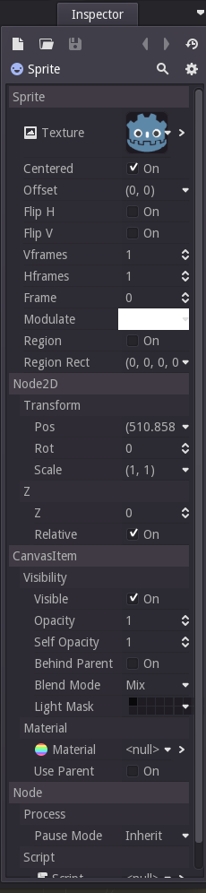

Title: Godot 101 - Частина 2: Скриптування 
Date: 2019-09-27 23:48
Category: 101
Tags: Godot, tutor
Modified: 2019-09-27 23:48

Це друга частина серії "Godot 101", де ми ознайомимося з мовою написання скриптів (сценаріїв) Godot, яка називається GDScript. Якщо ви ще ознайомлені з першою частиною, то запрошуємо це зробити.

## Про цю серію
Godot 101 - це вступ до використання ігрового двигуна Godot та того, як він працює. Якщо ви ніколи раніше не використовували ігровий движок або ви просто новачок у Godot, це буде хорошим місцем для початку. Якщо ви тут вперше, то коротко про цей сайт [KidsCanCode](http://kidscancode.org): ми називаємося KidsCanCode, тому що ми навчаємо програмуванню та розробці ігор дітям, але якщо ви дорослий, ласкаво просимо тут також. Ми не віримо у викидання матеріалів для дітей, а розробка ігор складна - тому, ймовірно, це буде складно, незалежно від вашого віку.

Ви можете переглянути відео-версію цього уроку тут:
<iframe width="560" height="315" src="https://www.youtube.com/embed/gHA4M2cqWb0" frameborder="0" allow="accelerometer; autoplay; encrypted-media; gyroscope; picture-in-picture" allowfullscreen></iframe>

## Скрипти (Сценарії)
В останній частині ми створили наш вузол Sprite і встановили його текстуру. Однак, переглянувши вкладку Inspector, ви побачите, що існує багато властивостей, які можна встановити для цього вузла:

Наприклад, якщо взяти спрайт і перемістити його, ви побачите зміну властивості Pos. Ви також можете натиснути на властивість та ввести потрібні координати. Для написання сценарію, який буде рухати спрайт, це властивість, яку ми хочемо контролювати.

Тож додамо скрипт (сценарій). Клацніть правою кнопкою миші на спрайт на вкладці сцени та оберіть Додати сценарій (Add Script). Після чого Ви побачите наступне вікно:

